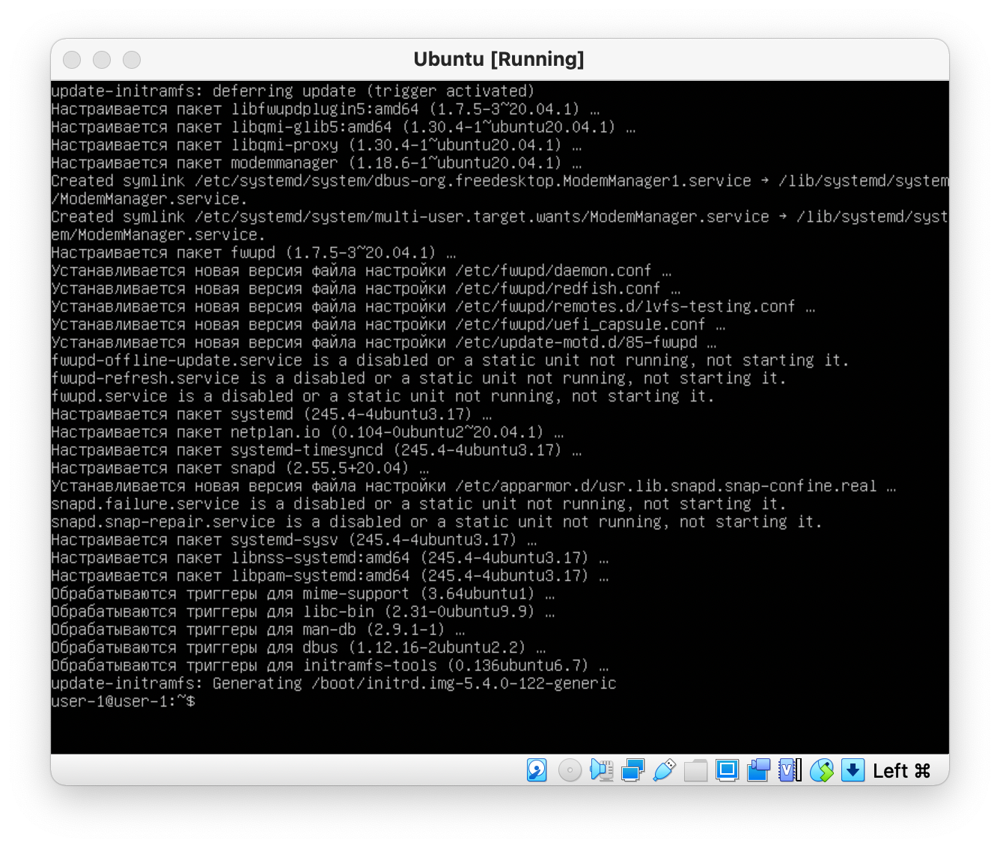
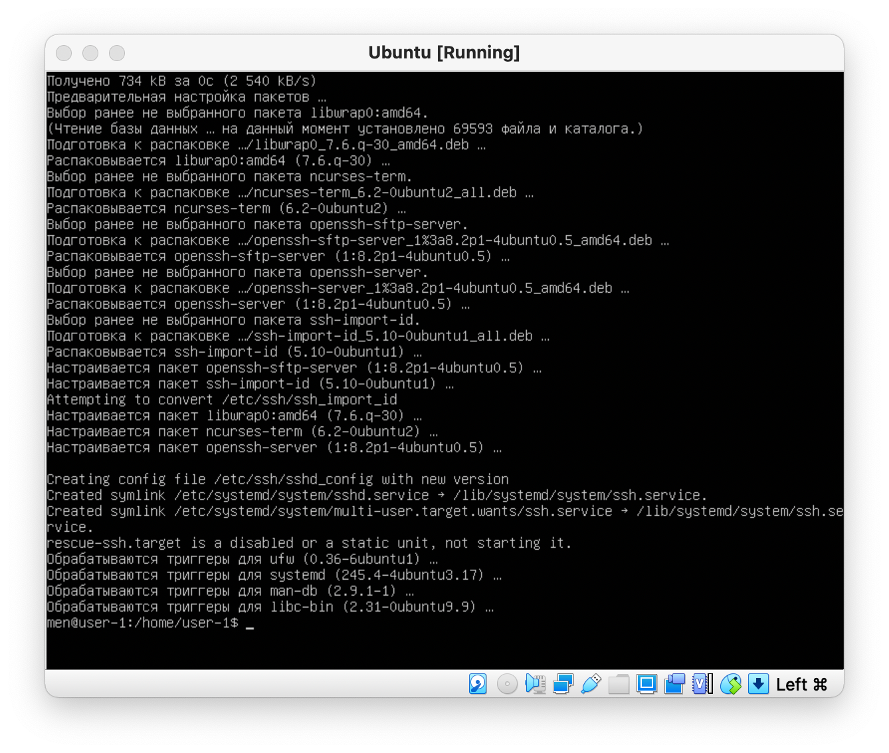
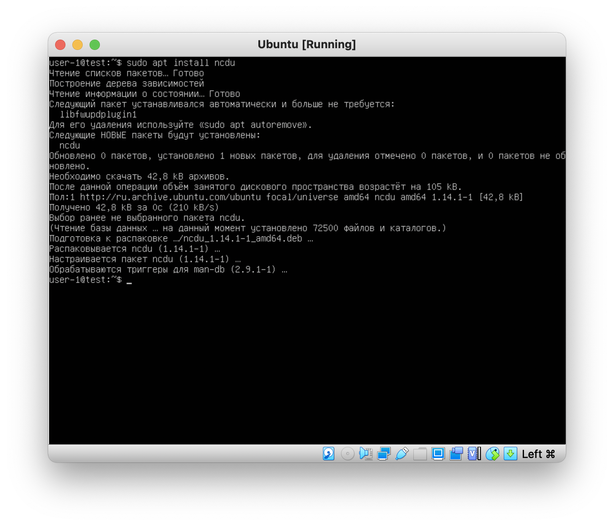

# Отчёт по заданию: Операционные системы UNIX/Linux (Базовый).
1. [Установка ОС](#part-1-установка-ос)  
2. [Создание пользователя](#part-2-создание-пользователя)  
3. [Настройка сети ОС](#part-3-настройка-сети-ос)   
4. [Обновление ОС](#part-4-обновление-ос)  
5. [Использование команды  sudo](#part-5-использование-команды-sudo)  
6. [Установка и настройка службы времени](#part-6-установка-и-настройка-службы-времени)  
7. [Установка и использование текстовых редакторов](#part-7-установка-и-использование-текстовых-редакторов)  
8. [Установка и базовая настройка сервиса SSHD](#part-8-установка-и-базовая-настройка-сервиса-sshd)   
9. [Установка и использование утилит top, htop](#part-9-установка-и-использование-утилит-top-htop)   
10. [Использование утилиты fdisk](#part-10-использование-утилиты-fdisk)   
11. [Использование утилиты df](#part-11-использование-утилиты-df)
12. [Использование утилиты du](#part-12-использование-утилиты-du)
13. [Установка и использование утилиты ncdu](#part-13-установка-и-использование-утилиты-ncdu)
14. [Работа с системными журналами](#part-14-работа-с-системными-журналами) 
15. [Использование планировщика заданий CRON](#part-15-использование-планировщика-заданий-cron)
## Условия задания
В качестве результата работы должен быть предоставлен отчет по выполненным задачам. В каждой части задания указано, что должно быть помещено в отчёт, после её выполнения. Это могут быть скриншоты, какие-то данные и т.д.
* В репозиторий, в папку src, должен быть загружен отчёт с расширением .md.
* В отчёте должны быть выделены все части задания, как заголовки 2*го уровня.
* В рамках одной части задания всё, что помещается в отчёт, должно быть оформлено в виде списка.
* Каждый скриншот в отчёте должен быть кратко подписан (что показано на скриншоте).
* Все скриншоты обрезаны так, чтобы была видна только нужная часть экрана.
## Part 1. Установка ОС
Использованные команды:
`cat /etc/issue`

## Part 2. Создание пользователя
Использованные команды:
* ` sudo adduser men`
* ` sudo usermod -aG sudo men`
* ` cat /etc/passwd`

## Part 3. Настройка сети ОС
1. Смена названия машины
* ` hostnamectl`
* ` sudo hostnamectl set-hostname user-1`
* ` sudo nano /etc/hosts`
* ` sudo nano /etc/hosts`
* ` sudo nano /etc/hostname`
* ` sudo nano /etc/cloud/cloud.cfg`
* ` sudo reboot`
2. Смена временной зоны по местоположению
* ` timedatectl`
* ` sudo hostnamectl set-hostname user-1`
* ` timedatectl list-timezones`
* ` sudo timedatectl set-timezone Europe/Moscow`
3. Вывод названия сетевых интерфейсов
* `sudo ip a`
* loopback - это официальный стандарт, неотъемлемая часть unix/linux системы, не важно, серверной или настольной. нужен для работы многих приложений, для тестирования.
Картинка - доступные интерфейсы.

4. Получение ip адрес устройства от DHCP сервера
* `ip address` (получен ip: 127.0.0.1/8)
* В общем случае настройки, передаваемые DHCP сервером DHCP клиентам включают:
* IP адрес и сетевую маску
* IP адрес шлюза по умолчанию
* IP адрес DNS серверов
* Однако DHCP сервер может также предоставить такие параметры настройки, как:
* Имя хоста
* Имя домена
* Адрес сервера времени
* Адрес сервера печати
* Преимущество использования DHCP заключается в изменчивости сети, например, изменение адреса DNS сервера потребует изменений только на DHCP сервере, а все сетевые хосты будут перенастроены в момент следующего запроса их DHCP клиента к DHCP серверу. Дополнительное преимущество заключается в простом подключении новых компьютеров к сети, поскольку не требуется проверять доступность IP адресов. Конфликты по выделенным IP адресам также минимальны.
5. Определение и вывод на экран внешний ip-адрес шлюза (ip) и внутренний IP-адрес шлюза, он же ip-адрес по умолчанию (gw).
* `routel` - параметры по умолчанию
6. Задать статичные (заданные вручную, а не полученные от DHCP сервера) настройки ip, gw, dns (использовать публичный DNS серверы, например 1.1.1.1 или 8.8.8.8).
* `routel` - параметры по умолчанию
* `sudo su`
* `cd /etc/netplan/`
* `nano 00-installer-config.yaml`
7. Перезагрузить виртуальную машину. Убедиться, что статичные сетевые настройки (ip, gw, dns) соответствуют заданным в предыдущем пункте.
* `ping 1.1.1.1 & ping 8.8.8.8`

## Part 4. Обновление ОС
 Для установки используем нижеперечисленные команды и дожидаемся установки:
* `sudo apt update && sudo apt upgrade`

## Part 5. Использование команды **sudo**
Использованные команды:
* ` sudo usermod -aG sudo men`

Использованные команды:
* ` sudo su men`
* ` sudo hostnamectl set-hostname test`
* ` hostnamectl`

## Part 6. Установка и настройка службы времени
При установке настройки времени были применены автоматически
Использованные команды:
* `timedatectl show`

## Part 7. Установка и использование текстовых редакторов 
* Создаем файл при помощи vim `vim test_vim.txt`

Пишем aladales, жмем `ESC`, пишем `:wq`
* Создаем файл при помощи nano `nano test_nano.txt`

Пишем aladales, жмем `control+x`, жмем `y`, `enter`
* Создаем файл при помощи MCEDIT `mcedit test_mcedit.txt`

Пишем aladales, жмем `fn+F2`, жмем `enter`, `fn+F10`
* Открываем файл при помощи vim `vim test_vim.txt`

Пишем `:%s/aladales/21 School 21/g`
* Открываем файл при помощи nano `nano test_nano.txt`

Жмем `Ctrl+\` пишем aladales, жмем `Enter` пишем 21 School 21, жмем `control+x`, жмем `y`, `enter`
* Открываем файл при помощи MCEDIT `mcedit test_mcedit.txt`

Жмем `fn+F4`, жмем `вниз`, пишем 21 School 21, жмем `enter`. жмем `fn+F2`, жмем `enter`, `fn+F10`
* Для поиска при помощи vim открываем файл и пишем `/` после текст для поиска
* Для поиска при помощи nano открываем файл и жмем `control + W` после текст для поиска
* Для поиска при помощи mcedit открываем файл и пишем `fn + F7` после текст для поиска
## Part 8. Установка и базовая настройка сервиса **SSHD**
* Установить службу SSHd `sudo apt install openssh-server`

* Автозагрузка `sudo systemctl enable sshd`
* Для изменения порта на 2022 требуется отредактировать файл nano /etc/ssh/sshd_config Найти и заменить `#Port 22` на `Port 2022`
* Для применения изменений `/etc/init.d/ssh restart`
* sshd это демон, который ожидает соединения от клиентов. Обычно он запускается при загрузке системы из /etc/rc. Он создает нового демона для каждого нового соединения. Ответвленный демон обрабатывает обмен ключами, шифрование, аутентификацию, выполнение команд и обмен данными. Эта реализация sshd поддерживает обе версии протокола SSH, 1 и 2, одновременно. sshd работает следующим образом.
* Проверка наличия процесса sshd `ps -ef | grep sshd`

Столбцы, возвращенные ps представляют некоторую ключевую информацию.
* Устанавливаем и запускаем `sudo apt install net-tools`, далее `netstat -tan`

- a - показывать состояние всех сокетов. Обычно сокеты, используемые серверными процессами, не показываются.
- t - просмотр только tcp соединений
- n - показывать сетевые адреса как числа. netstat обычно показывает адреса как символы. Эту опцию можно использовать с любым форматом показа.
## Part 9. Установка и использование утилит top, htop
* Для установки пишем `sudo apt install htop`
* Запускаем `top`

* Запускаем `htop`

## Part 10. Использование утилиты **fdisk**
* Для запуска утилиты fdisk пишем `sudo fdisk -l`

fdisk — общее название системных утилит для управления разделами жёсткого диска. Широко распространены и имеются практически в любой операционной системе, но работают по-разному. Используют текстовый интерфейс пользователя.
* Из вывода мы видим, что название `ubuntu--vg-ubuntu--lv`, `8.25 GiB`, `8854175744` секторов, размер swap `17293312`
## Part 11. Использование утилиты **df** 
* Для запуска утилиты df пишем `df`

df (аббревиатура от disk free) — утилита в UNIX и UNIX-подобных системах, показывает список всех файловых систем по именам устройств, сообщает их размер, занятое и свободное пространство и точки монтирования.
* Для запуска утилиты df -Th корневого раздела пишем `df -Th`

- T - Выдавать тип для каждой файловой системы. Тип берётся от операционной системы (и определяется системно-зависимым способом, например посредством чтения файла /etc/mtab).
- h - Отобразит размер в человеко-читаемом формате, размерностью 1024, добавив названия единиц (Kибибайт, Mебибайт, Гибибайт, Tебибайт).
## Part 12. Использование утилиты **du**
* Для запуска du нужно ввести `du`

* Вывести размер папок /home, /var, /var/log `sudo du -s /home && sudo du -s /var && sudo du -s /var/log`

* Вывести размер всего содержимого в /var/log `du -a /var/log`

## Part 13. Установка и использование утилиты **ncdu**
* Для установки ncdu пишем `sudo apt install ncdu`

* Для запуска ncdu нужно ввести `ncdu`

* Вывести размер папки /home
`sudo ncdu /home`

* Вывести размер папки /var
`sudo ncdu /var`

* Вывести размер папки и содержимого /var/log
`sudo ncdu /var/log`

## Part 14. Работа с системными журналами
* Время последней успешной авторизации, имя пользователя и метод входа в систему

* Перезапустить службу SSHd и показать логи

## Part 15. Использование планировщика заданий **CRON**
* Установка cron `sudo apt install cron`
* Работа в фоновом режиме `sudo systemctl enable cron`

* Для редактирования `crontab -e` назначаем команду для запуска каждые 2 минуты `*/2 * * * * uptime`

Проверяем текущие задачи cron `crontab -l`

Для удаления задач cron пишем `crontab -r`
